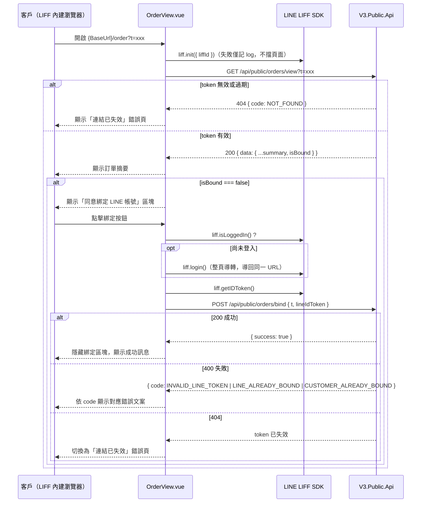

# LIFF 訂單查看與 LINE 綁定頁面設計

## 背景

後端正在開發「訂單分享連結、LINE 自動推播與客戶自動綁定」功能（對應後端 repo 的 `021-order-line-binding` 分支）。US1（分享連結簽發）後端已完成；US2（自動推播）、US3（客戶自助綁定）、US4（員工解除綁定）僅完成規劃，尚未實作。

本規格只涵蓋前端需要獨立實作、且不受後端進度阻擋的部分：**客戶端 LIFF 頁面**——業務/客服人員將訂單分享連結（`{BaseUrl}/order?t={token}`）透過既有管道（LINE、簡訊）人工轉貼給客戶後，客戶點擊連結開啟的頁面。此頁面顯示訂單摘要，並在客戶尚未綁定 LINE 帳號時，導引其透過 LIFF LINE Login 完成綁定，之後訂單狀態更新可自動透過 LINE 推播通知（推播本身是後端 US2 的範疇，前端無需處理）。

**明確排除於本次範圍之外**：
- 後端 US2～US4 的任何後端實作（不屬於本前端 repo）。
- V3 Admin 後台的「複製分享連結」按鈕與「解除 LINE 綁定」UI（文件第 2 節，屬於另一個後台前端專案）。
- Mock 資料層——後端 `GET /api/public/orders/view` 與 `POST /api/public/orders/bind` 目前均未上線，本地開發時打真實端點只會得到 404；此為預期行為，待後端端點上線後才能實際端到端驗證。

## 使用者流程

## 架構決策

### 路由與版面
- 新增路由 `/order`，元件 `src/views/OrderView.vue`，讀取 query 參數 `t`（`route.query.t`）。
- 路由設定新增 `meta: { minimal: true }`。
- `App.vue` 依 `route.meta.minimal` 條件式跳過現有 nav bar 與 footer，改為滿版極簡版面——原因：此頁預期嵌在 LINE 的 LIFF 內建瀏覽器中開啟，LINE 本身已提供上方列（分享/關閉等），額外疊加 REAL YOU 網站導覽列與頁尾會造成版面擁擠且與 LIFF app 慣例不符。
- 頁面本身仍可放一個小型品牌標記（比照 `ProductDetailView` hero 區的 favicon 小圖示），維持品牌識別，但不放置導覽連結或語言切換入口列——語言切換若需要可用頁面右上角一個小按鈕（比照證書卡 modal 內既有的 toggleLocale 按鈕樣式），不需要完整 nav bar。

### LIFF SDK 整合
- 新增依賴 `@line/liff`（官方 SDK）。
- 新增 `.env.example`，內容 `VITE_LIFF_ID=`；實際值由 LINE 官方帳號負責人提供後，於本地 `.env`（不進版控，已被 `.gitignore` 的 `*.local` 規則覆蓋不到，需另外確認 `.env` 是否要加進 `.gitignore`——見「待辦」）自行填入。程式碼中透過 `import.meta.env.VITE_LIFF_ID` 讀取。
- 元件掛載（`onMounted`）時即呼叫 `liff.init({ liffId: import.meta.env.VITE_LIFF_ID })`，與訂單摘要的 `GET /view` 呼叫**平行**進行、互不阻塞——瀏覽摘要不需要 LIFF 環境，只有點擊綁定按鈕才需要 LIFF 已就緒。`liff.init()` 失敗只記錄 `console.error`，不影響摘要顯示；使用者點擊綁定按鈕時才會看到「LINE 服務暫時無法使用，請稍後再試」之類的錯誤提示。

### API 呼叫慣例（沿用 `ProductDetailView.vue` 既有模式）
- 直接在元件內用 `axios` 呼叫，不另外抽 service/composable 層（與現有程式碼風格一致，專案規模也不需要額外的抽象層）。
- `GET /api/public/orders/view?t={token}`：成功時取 `response.data.data`；`t` 缺失時直接進入錯誤狀態，不發送請求。
- `POST /api/public/orders/bind`：body `{ t, lineIdToken }`。
- 錯誤處理**不透傳後端 `message` 原文**，一律用固定的 i18n 文案（比照現有 `detail.error404` / `detail.errorServer` 的作法）：
  - `GET /view` 回 404 → 固定「連結已失效」錯誤頁，不嘗試解析原因（後端刻意讓所有失效原因回傳相同內容，前端也不應該區分）。
  - `POST /bind` 回 400 → 依 `response.data.code` 對應到固定文案（見下方 i18n 章節的三種 code）。
  - `POST /bind` 回 404 → 視同分享連結本身失效，切換到與 `GET /view` 404 相同的錯誤頁面狀態。
  - 其餘非預期錯誤（網路錯誤、5xx）→ 顯示通用錯誤文案（比照 `detail.errorServer`）。

### 頁面狀態
| 狀態 | 觸發條件 | 畫面內容 |
|---|---|---|
| Loading | 掛載後、`GET /view` 回應前 | 沿用 `ProductDetailView` 的 loading spinner 樣式 |
| 連結失效 | `t` 缺失、或 `GET /view`／`POST /bind` 回 404 | 錯誤圖示 + 固定文案；若偵測到執行環境在 LIFF client 內（`liff.isInClient()`），顯示「關閉視窗」按鈕呼叫 `liff.closeWindow()`；否則不顯示任何按鈕 |
| 已綁定 | `GET /view` 成功且 `data.isBound === true` | 只顯示訂單摘要卡片，不顯示綁定相關 UI |
| 未綁定 | `GET /view` 成功且 `data.isBound === false` | 訂單摘要卡片 + 綁定操作區塊（說明文字 + 「同意綁定」按鈕） |
| 綁定中 | 使用者點擊綁定按鈕後、`POST /bind` 回應前 | 綁定按鈕顯示 loading 狀態並 disable，避免重複送出 |
| 綁定成功 | `POST /bind` 回 200 | 綁定區塊替換為成功訊息（打勾圖示 + 文案），無需重新呼叫 `GET /view`——直接把本地 `isBound` 狀態切為 `true` |
| 綁定失敗（可重試） | `POST /bind` 回 400 | 綁定區塊維持顯示，按鈕上方浮現對應錯誤文案，按鈕恢復可點擊狀態讓使用者重試 |

### 訂單摘要卡片內容
依 `GET /view` 回應的 `data` 直接渲染：
- `orderNumber`、`orderKindDisplay`、`status`、`orderDate`（格式化為在地日期字串）、`customerName`、`totalAmount`（貨幣格式化）。
- `items[]`：每筆顯示 `brand` / `style` / `amount`；`imageUrl` 若非 `null` 則顯示縮圖，否則顯示佔位圖示（比照 `ProductDetailView` 的空狀態處理精神，不做特殊的圖片 loading 動畫，保持簡單）。

### i18n
新增 `order` namespace（`en` + `zh-TW` 都要補齊），沿用現有 `detail.*` 的命名風格：
- `order.loading`
- `order.errorInvalidLink`（連結已失效／過期，涵蓋 `t` 缺失、`view` 404、`bind` 404 三種情境）
- `order.errorServer`（通用非預期錯誤）
- `order.closeWindow`（僅 LIFF client 內顯示）
- `order.summary.*`（`orderNumber` / `orderKind` / `status` / `orderDate` / `customerName` / `totalAmount`／`itemsHeading`）
- `order.bind.prompt`（說明文字）、`order.bind.button`、`order.bind.submitting`
- `order.bind.success`
- `order.bind.errors.invalidLineToken`、`order.bind.errors.lineAlreadyBound`、`order.bind.errors.customerAlreadyBound`（對照文件第 3.3 節的三種 `code`）
- `order.bind.errorLiffUnavailable`（`liff.init()` 失敗時，使用者點擊綁定按鈕才顯示）

## 實作注意事項
1. 目前專案沒有任何 `.env*` 檔案或規則；實作時會新增 `.env` 到 `.gitignore`，避免之後真實 LIFF ID 被誤 commit。
2. 真實 `VITE_LIFF_ID` 值：待你或 LINE 官方帳號負責人提供後，自行填入本機 `.env`（不進版控），程式碼不需要異動。
3. 後端 `GET /view` 與 `POST /bind` 端點上線前，本頁面在本地開發環境會持續呈現「連結已失效」狀態（因為打不到後端）——這是預期行為，等後端 US2/US3 部署後才能端到端驗證完整綁定流程。

## 不在此規格範圍內
- 後端任何實作（不同 repo）。
- V3 Admin 後台「複製分享連結」與「解除 LINE 綁定」UI。
- Mock API 資料層。
- LIFF SDK 版本以外的 LINE 官方帳號 / Channel 後台設定（例如 LIFF App 的 Endpoint URL 設定、Messaging API channel 設定等），這些是 LINE 官方帳號負責人／後端的職責。
