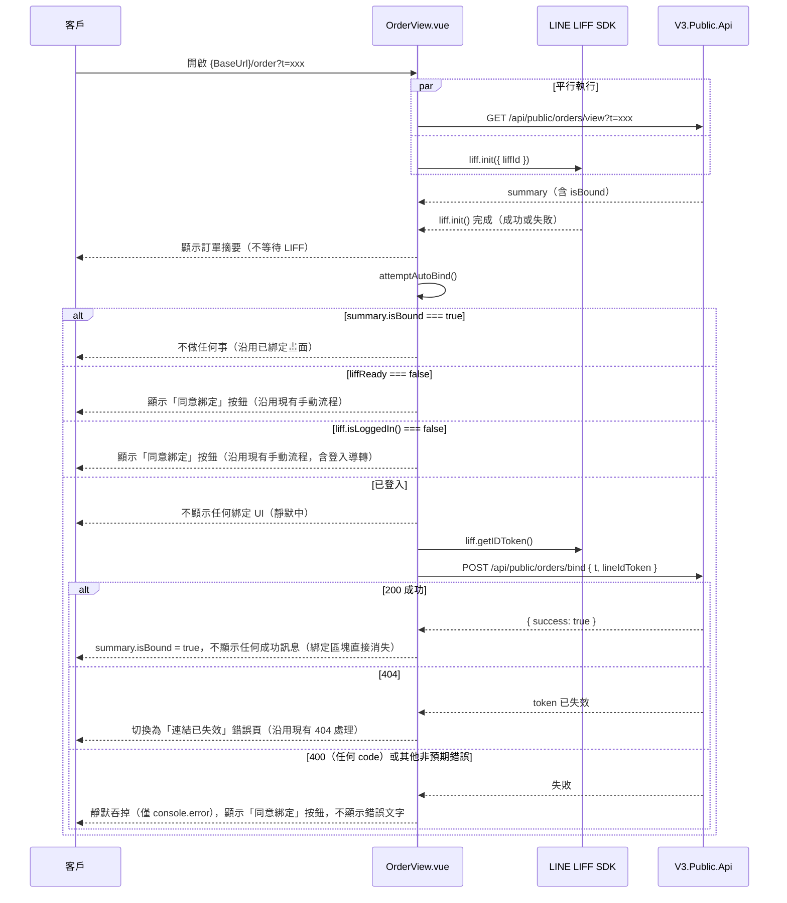

# 訂單頁面靜默自動綁定設計

## 背景

`src/views/OrderView.vue`（見 [[2026-07-23-liff-order-view-design]]）目前的 LINE 綁定流程需要使用者手動點擊「同意綁定」按鈕才會觸發：檢查 `liff.isLoggedIn()` → 未登入則整頁導轉 LINE Login → 已登入則呼叫 `POST /api/public/orders/bind`。

由於此頁面預期主要在 LIFF 內建瀏覽器中開啟，使用者在該情境下幾乎必然已透過 LINE 自動登入（`liff.isLoggedIn() === true`），手動點擊按鈕這個動作本身並不必要，只是徒增一次操作。本次調整讓頁面在「已知使用者已登入 LINE」且「尚未綁定」的情況下，自動在背景完成綁定，不需要使用者採取任何動作；只有在無法確認登入狀態時才退回顯示現有的手動按鈕流程。

## 使用者流程



## 架構決策

### 觸發時機
`onMounted` 改為：

```js
onMounted(async () => {
  await Promise.all([fetchOrderSummary(), initLiff()])
  attemptAutoBind()
})
```

`fetchOrderSummary()` 與 `initLiff()` 內部各自的 `loading` / `summary` / `liffReady` 賦值時機不變，因此訂單摘要仍會在 `GET /view` 一回來就立即顯示，不受這個改動影響（`loading`、`summary` 的更新發生在函式內部，不受外層 `await Promise.all` 是否完成影響）。`attemptAutoBind()` 只是被延後到兩者都 settle 之後才呼叫，確保判斷 `isBound` 與 `liffReady`/登入狀態時兩者皆為最新值。

### `attemptAutoBind()` 邏輯
新增函式，條件式地執行與 `handleBind` 相同的綁定步驟，但**跳過登入判斷與導轉**：

- `!summary.value || summary.value.isBound` → 不執行。
- `!liffReady.value` → 不執行（退回顯示手動按鈕）。
- `!liff.isLoggedIn()` → 不執行（退回顯示手動按鈕，使用者點擊後沿用現有 `handleBind` 導轉登入流程）。
- 以上皆非 → 設定 `autoBindInProgress.value = true`，呼叫 `liff.getIDToken()` → `POST /api/public/orders/bind`：
  - 成功 → `summary.value.isBound = true`。
  - 404 → 視同分享連結失效，`summary.value = null`、`error.value = t('order.errorInvalidLink')`（與現有 `handleBind` 的 404 分支一致）。
  - 其他失敗（400 任何 code、網路錯誤、5xx）→ 僅 `console.error`，**不**設定 `bindError`。
  - `finally` 中將 `autoBindInProgress.value = false`。

不特別記憶「這個 LINE 帳號 / 這張訂單永久無法綁定」的狀態（例如 `LINE_ALREADY_BOUND`、`CUSTOMER_ALREADY_BOUND`）——每次重新進入頁面都會重新靜默嘗試一次，失敗一樣静默吞掉。這是刻意的簡化取捨：多一次後端呼叫的成本，遠低於額外維護一套用戶端「永久失敗記憶」機制（例如 sessionStorage 加上 token/LINE user id 的對照）的複雜度。

### 樣板（template）異動
綁定區塊的 `v-if` 從：

```html
<div v-if="!summary.isBound" ...>
```

改為：

```html
<div v-if="!summary.isBound && !autoBindInProgress" ...>
```

其餘內容（提示文字、按鈕、`bindError` 顯示、`binding` 狀態的 disabled/loading 文字）完全不變——手動點擊流程（`handleBind`、`binding`、`bindError`）維持原樣，這次調整只新增一條「跳過按鈕、直接靜默嘗試」的路徑，兩條路徑除了觸發方式與錯誤呈現方式不同之外，呼叫的是同一組 API。

**成功後不顯示任何確認訊息**：無論是透過自動靜默綁定、還是使用者手動點擊按鈕完成綁定，一旦 `summary.isBound` 變成 `true`，原本的「✓ 已完成 LINE 綁定」成功區塊**整個移除**，綁定區塊直接消失，頁面只剩下訂單摘要——這是刻意決定，目的是讓整個綁定流程對使用者來說盡量無感、安靜地在背後完成，不需要額外的確認提示。對應的 `order.bind.success` i18n 字串（`en`／`zh-TW` 皆有）一併移除，因為不再有任何地方引用它。

### 附帶效果
使用者若在未登入狀態下手動點擊按鈕，經過 `liff.login()` 導轉登入後導回同一網址，此時新一輪 `liff.init()` 會回報 `isLoggedIn() === true`，`attemptAutoBind()` 因此會自動完成綁定，使用者不需要在導回頁面後再點第二次按鈕。

## 不在此規格範圍內
- 後端 API 或錯誤 code 的任何異動。
- 針對永久性失敗（`LINE_ALREADY_BOUND` / `CUSTOMER_ALREADY_BOUND`）的用戶端記憶/防重試機制——已在澄清問題中明確決定不做。
- i18n 文案異動——本次改動不引入任何新的使用者可見文字。
