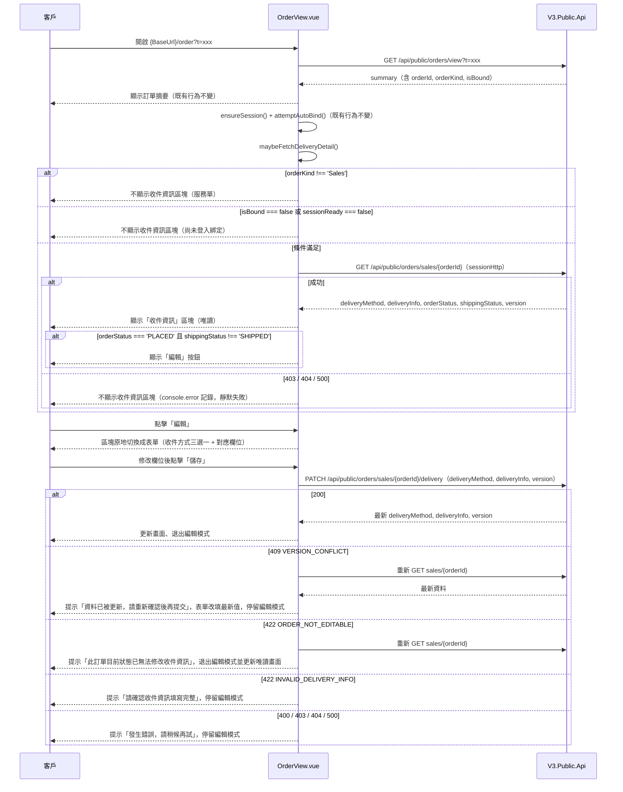

# 訂單收件資訊顯示與編輯設計

## 背景

`src/views/OrderView.vue`（見 [[2026-07-23-liff-order-view-design]]、[[2026-07-25-order-auto-bind-design]]）目前透過分享連結 `t` token 呼叫 `GET /api/public/orders/view` 顯示訂單摘要，回應的 `PublicOrderSummaryResult` 不含收件（配送）相關欄位。

後端 `http://localhost:5100/swagger/v1/swagger.json` 另外提供了已登入會員專用的訂單明細與收件資訊修改端點：

- `GET /api/public/orders/sales/{id}` — 查詢目前登入會員自己的銷售訂單明細，含 `deliveryMethod`、`deliveryInfo`、`orderStatus`、`shippingStatus`、樂觀鎖 `version`。
- `PATCH /api/public/orders/sales/{id}/delivery` — 修改目前登入會員自己的銷售訂單收件方式與收件資訊。

服務單（收購/寄賣，`GET /api/public/orders/service/{id}` 對應的 `CustomerServiceOrderDetailResult`）完全沒有 `deliveryMethod`/`deliveryInfo` 欄位，本次功能不涉及服務單。

本次目標：在既有訂單頁面上，於使用者登入並完成 LINE 綁定後，額外顯示該訂單的收件資訊；若訂單狀態符合可編輯條件，允許使用者直接在頁面上修改收件方式與收件資訊。

## API 對應總覽

| 用途 | Method | Path | 認證 | 備註 |
|---|---|---|---|---|
| 訂單摘要（既有，不變） | GET | `/api/public/orders/view?t=` | 分享 token，無需登入 | 回傳 `PublicOrderSummaryResult`，含 `orderId`、`orderKind`、`isBound` |
| 銷售訂單明細（新增） | GET | `/api/public/orders/sales/{id}` | 需 `sessionHttp`（客戶 JWT） | 回傳 `CustomerSalesOrderDetailResult`，含 `deliveryMethod`、`deliveryInfo`、`orderStatus`、`shippingStatus`、`version` |
| 修改收件資訊（新增） | PATCH | `/api/public/orders/sales/{id}/delivery` | 需 `sessionHttp`（客戶 JWT） | body 為 `UpdateOrderDeliveryRequest`，回傳 `UpdateOrderDeliveryResponse` |

`sessionHttp` 是 `src/composables/useCustomerSession.ts` 已存在但目前尚無任何頁面使用的授權 axios instance（request interceptor 自動帶 `Authorization: Bearer <token>`），本次功能是它的第一個使用場景。

## 使用者流程



## 架構決策

### OrderKind 判斷

`OrderKind` 為字串 enum（`"Service" | "Sales"`，非數字）。收件資訊區塊僅在 `summary.orderKind === 'Sales'` 時才進入後續流程；`'Service'` 完全不呼叫任何收件相關 API、不顯示任何收件 UI。

### 資料抓取時機

新增 `maybeFetchDeliveryDetail()`，條件為 `summary.orderKind === 'Sales' && summary.isBound === true && sessionReady === true`。呼叫時機（三處）：

1. `onMounted` 內，`Promise.all([fetchOrderSummary(), ensureSession()])` 完成後（比照既有 `attemptAutoBind()` 的呼叫位置）。
2. `handleBind()` 成功、`summary.isBound` 變為 `true` 之後。
3. `attemptAutoBind()` 成功、`summary.isBound` 變為 `true` 之後。

`GET /api/public/orders/sales/{orderId}` 呼叫失敗（403 / 404 / 500）時比照現有 auto-bind 靜默失敗慣例：僅 `console.error` 記錄，不顯示任何錯誤文字，收件資訊區塊單純不出現——不影響訂單摘要本身的顯示。

### 新增型別

```ts
type OrderKind = 'Service' | 'Sales'
type DeliveryMethod = 'HOME_DELIVERY' | 'STORE_PICKUP' | 'PICKUP'

interface HomeDeliveryInfo {
  recipientName: string
  recipientPhone: string
  recipientAddress: string
}
interface StorePickupInfo {
  storeInfo: string
  recipientName: string
  recipientPhone: string
}
interface PickupInfo {
  location: string
  pickupTime?: string | null
}

interface SalesOrderDeliveryDetail {
  orderStatus: string
  shippingStatus: string
  deliveryMethod: DeliveryMethod | null
  deliveryInfo: HomeDeliveryInfo | StorePickupInfo | PickupInfo | null
  version: number
}
```

`deliveryInfo` 三種形狀依 `deliveryMethod` 對應（來源：後端 `Core/Models/Dtos/CustomerDeliveryInfoDtos.cs`）。命名容易搞混：`PICKUP` = 門市自取、`STORE_PICKUP` = 超商取貨，實作時需特別留意對應關係，避免寫反。

### 新元件：`src/components/OrderRecipientSection.vue`

拆成獨立元件而非直接塞進 `OrderView.vue`（目前已 330+ 行）。

- **Props**：`detail: SalesOrderDeliveryDetail`、`orderId: string`
- **Emits**：`updated`，帶更新後的 `SalesOrderDeliveryDetail`，供 `OrderView.vue` 更新本地狀態
- 內部使用 `sessionHttp`（直接 import，比照 `OrderView.vue` 既有「axios 直接呼叫在元件內、不另建 service 層」的慣例，見 [[2026-07-23-liff-order-view-design]]）
- 元件內部自行管理「唯讀 / 編輯中」兩種顯示模式，透過 local `ref` 切換，不使用 modal

#### 唯讀模式

卡片樣式比照現有訂單摘要卡片（`bg-white border border-outline-variant/30 shadow-sm`）。顯示：

- 收件方式中文名稱（`HOME_DELIVERY`→宅配／`STORE_PICKUP`→超商取貨／`PICKUP`→門市自取）
- 依方式顯示對應欄位內容（唯讀文字）
- 若 `orderStatus === 'PLACED' && shippingStatus !== 'SHIPPED'`，卡片右上角顯示「編輯」按鈕；否則不顯示編輯入口，也不額外顯示「不可編輯」提示文字（唯讀呈現本身就是狀態）

#### 編輯模式

點擊「編輯」後，同一區塊原地切換成表單：

- 最上方為收件方式三選一（radio 或 select），**允許使用者切換收件方式**；切換後下方欄位跟著換成對應方式的欄位，並清空欄位內容（不嘗試在不同方式間映射欄位值）
- 三種方式底下皆為純文字 `<input type="text">`：
  - `HOME_DELIVERY`：收件人姓名、收件人電話、收件地址（皆必填）
  - `STORE_PICKUP`：超商門市資訊、收件人姓名、收件人電話（皆必填）
  - `PICKUP`：取貨地點（必填）
- `PickupInfo.pickupTime` **v1 不放入表單**：若原始 `deliveryInfo` 含 `pickupTime`，送出時原樣帶回、不覆蓋為 `null`；若使用者切換到 `PICKUP` 以外的方式又切回來，`pickupTime` 視同遺失（不特別處理，因為此時使用者本來就在重新編輯收件方式，屬於合理行為）
- 前端送出前對必填欄位做 `trim()` 後非空驗證，未通過就地顯示提示文字、不送出請求（對應後端 `INVALID_DELIVERY_INFO` 驗證邏輯提前擋掉明顯錯誤，非重複實作完整驗證規則）
- 底部「儲存」「取消」按鈕；「取消」直接丟棄表單內容、退回唯讀模式顯示原資料；儲存中兩按鈕皆 disable，「儲存」文字改為 loading 文案（比照現有 `handleBind` 的 `binding` 狀態模式）

### 送出與錯誤處理

`PATCH /api/public/orders/sales/{orderId}/delivery`，body：`{ deliveryMethod, deliveryInfo, version: detail.version }`。

| 情況 | code | 處理 |
|---|---|---|
| 成功 | 200 | 用回應的 `UpdateOrderDeliveryResponse` 更新本地 `detail`（含新 `version`），退出編輯模式 |
| 樂觀鎖衝突 | 409 `VERSION_CONFLICT` | 提示「資料已被更新，請重新確認後再提交」；自動重新 `GET /api/public/orders/sales/{orderId}` 取得最新 `deliveryMethod`/`deliveryInfo`/`version`，覆蓋表單目前顯示值；**不自動重送**，停留編輯模式待使用者確認後再次按「儲存」 |
| 狀態已不可編輯 | 422 `ORDER_NOT_EDITABLE` | 提示「此訂單目前狀態已無法修改收件資訊」；重新 `GET` 一次更新 `orderStatus`/`shippingStatus`，退出編輯模式回到唯讀顯示（此時唯讀畫面的「編輯」按鈕也會因狀態更新而自動消失） |
| 欄位驗證失敗 | 422 `INVALID_DELIVERY_INFO` | 提示「請確認收件資訊填寫完整」，停留編輯模式讓使用者修正 |
| 其他 | 400（無 code，`ValidationProblemDetails`）／403 `FORBIDDEN`／404 `NOT_FOUND`／500 `INTERNAL_ERROR` | 統一顯示通用訊息「發生錯誤，請稍候再試」，停留編輯模式（這幾種在「已成功載入明細才進入編輯」的前提下都屬異常邊界情況，沒有需要區分文案的必要） |

400 的回應是 ASP.NET Core 預設 `ValidationProblemDetails`（`application/problem+json`），格式與其他錯誤（含 `success`/`code`/`traceId` 的自訂 `ApiResponseModel`）不同，錯誤處理程式碼不能假設所有非 200 回應都長一樣的形狀——判斷順序應先看 HTTP status，再視情況讀取 `code`，而非直接假設 body 一定有 `code` 欄位。

### i18n

`src/i18n.ts` 新增 `order.recipient.*`（`en`、`zh-TW` 皆須新增，沿用現有扁平巢狀物件慣例）：

- `title`
- `methods.HOME_DELIVERY` / `methods.STORE_PICKUP` / `methods.PICKUP`
- `fields.recipientName` / `fields.recipientPhone` / `fields.recipientAddress` / `fields.storeInfo` / `fields.location`
- `editButton` / `saveButton` / `cancelButton` / `saving`
- `errors.versionConflict` / `errors.notEditable` / `errors.invalidInfo` / `errors.generic`
- `validation.required`

## 測試/驗證方式

專案無測試框架與 lint（見 CLAUDE.md），依現有慣例驗證：

1. `npm run type-check`（`vue-tsc --noEmit`）
2. `npm run build`
3. `npm run dev` 手動瀏覽器測試，需準備三種後端測試資料：
   - 狀態 `PLACED` 且已綁定 LINE 的銷售訂單 → 應顯示收件資訊 + 可編輯，含切換收件方式、409 衝突、422 兩種驗證錯誤的模擬
   - 非 `PLACED` 或 `shippingStatus === 'SHIPPED'` 的銷售訂單 → 應顯示收件資訊但無編輯按鈕
   - 服務單（`orderKind === 'Service'`） → 完全不顯示收件資訊區塊

## 後續調整（2026-08-06）

### 第一輪：儲存成功後改為重新 GET

實際使用時發現：PATCH 成功（200）後直接信任回應 body 拼出畫面顯示的 `detail`，懷疑回應內容與伺服器實際落地結果不一致，導致畫面顯示錯誤的資訊、使用者得手動重新整理整個頁面才會看到正確內容。因此把成功分支也改成呼叫既有的 `refetchDetail()`（重新 `GET /api/public/orders/sales/{orderId}`），跟 409 `VERSION_CONFLICT` 分支使用同一套「不信任回應 body、以重新 GET 的結果為準」邏輯。

### 第二輪：發現真正根因是 `deliveryInfo` 被序列化成字串

第一輪的懷疑其實抓錯方向。實際拿到的 response 範例：

```json
{
  "success": true,
  "data": {
    "deliveryMethod": "HOME_DELIVERY",
    "deliveryInfo": "{\"recipientName\":\"莊承展\",\"recipientPhone\":\"0986053648\",\"recipientAddress\":\"中正北路430號6樓之10\"}",
    "version": 5
  }
}
```

`data.deliveryInfo` 實際上是**一段 JSON 字串**，不是巢狀物件——推測是後端資料庫存的是 JSON text 欄位，API 沒有在回應這層反序列化。前端原本全程 `as SalesOrderDeliveryDetail` 直接轉型讀取 `d.recipientName`／`d.location` 等欄位，讀到的其實是字串上不存在的屬性、全部是 `undefined`，畫面才會看起來像欄位空白。這個問題在 GET 與 PATCH 兩個端點的回應都存在，跟第一輪「改用重新 GET」與否無關——不改成重新 GET 一樣會空白，改了也不會自動修好。

新增 `parseSalesOrderDeliveryDetail()`（`src/types/orderDelivery.ts`），統一在 `deliveryInfo` 是字串時 `JSON.parse()` 轉成物件，兩個消費點（`OrderView.vue` 的 `maybeFetchDeliveryDetail()`、`OrderRecipientSection.vue` 的 `refetchDetail()`）都改用這個函式，不再直接 `as SalesOrderDeliveryDetail` 轉型了事。

### 第三輪：PICKUP（門市自取）的取貨地點改為下拉選單

原本 `pickupForm.location` 是純文字輸入框，使用者手動打店名容易打錯字，改為從後端門市清單挑選。查 swagger（`http://localhost:5100/swagger/v1/swagger.json`）確認端點為 `GET /api/public/stores`，回應：

```json
{
  "success": true,
  "code": "SUCCESS",
  "message": "查詢成功",
  "data": [{ "code": "00", "name": "總店" }],
  "timestamp": "...",
  "traceId": "..."
}
```

此端點要求帶 JWT（門市清單只給已登入客戶查），因此跟其他訂單相關呼叫一樣用 `sessionHttp`（會自動附上 `Authorization`），不是一般 `axios`。（開發過程中曾誤判：本機測試初期未帶 token 直接 `curl` 該端點也回 200，一度以為不需要登入即可存取而改用一般 `axios`；之後確認實際規格要求要帶 JWT，已改回 `sessionHttp`——見本文件 git 歷史。）

**踩過的坑（命名混淆）**：第一版誤把下拉選單套到 `STORE_PICKUP`（超商取貨，7-11／全家等第三方通路）分頁的 `storeInfo` 欄位，而不是 `PICKUP`（門市自取，指自家門市）分頁的 `location` 欄位——這正是 `types/orderDelivery.ts` 檔頭註解特別提醒過的命名陷阱（「PICKUP = 門市自取，STORE_PICKUP = 超商取貨，容易搞混」）。使用者實測發現「門市自取」分頁沒有出現下拉選單後才抓到這個誤植，已修正為套用在 `PICKUP` 分頁的 `location` 欄位，`STORE_PICKUP` 的 `storeInfo` 改回原本的純文字輸入（超商取貨走第三方系統，本來就不適用 `/api/public/stores` 這份自家門市清單）。

送到後端的 `deliveryInfo.location` 欄位型別維持不變、仍是純文字（後端資料庫本來就只存字串，沒有門市代碼欄位可對應），下拉選單只是把可選值收斂成後端目前有效的門市名稱清單，`<select v-model="pickupForm.location">` 的 `value` 直接綁 `name`、不是 `code`。

`OrderRecipientSection.vue` 新增：

- `storeOptions` / `storeListState`（`idle` / `loading` / `loaded` / `error`）：`loadStoreOptions()` 呼叫 `GET /api/public/stores`，在 `startEditing()` 進入編輯模式時觸發（惰性載入、以 `storeListState` 擋重複呼叫），不在元件掛載當下就抓，避免使用者根本沒點編輯就多打一次 API。
- `storeSelectOptions`：把既有（可能是舊資料裡不在門市清單內的自由文字）`pickupForm.location` 併入選項清單，避免使用者一打開編輯表單就看到下拉選單空白、實際上底層欄位是有值的。
- 門市清單載入失敗時（`storeListState === 'error'`），退回原本的純文字輸入框並顯示提示文案（`order.recipient.storeLoadError`），確保 API 掛掉時使用者仍能手動輸入完成編輯，不會被下拉選單卡住。

### 第四輪：切換分頁再切回原本方式時，原始資料被誤清空

`selectMethod()` 原本的設計是「切換收件方式時，清空新方式底下的欄位——不嘗試在不同方式間映射欄位值」，這條規則原意是處理使用者主動改用不同收件方式的情境。但它沒有分辨「切到一個訂單原本就不是這個方式」跟「切回訂單原本就是這個方式」——後者也被一併清空。實際場景：訂單原本的收件方式就是 `PICKUP`，编辑表單一開始正確帶出原始門市；使用者點開別的分頁看一眼（例如「超商取貨」），再點回「門市自取」，`selectMethod('PICKUP')` 判斷 `formMethod.value !== method`（此時是 `STORE_PICKUP`），於是把 `pickupForm.location` 清成空字串——下拉選單自然沒有任何選項會被選中，使用者回報「切到其他分類後，原始門市不會出現在選單預設選擇上」。

修法：把 `startEditing()` 跟 `selectMethod()` 兩處載入原始資料的邏輯合併成 `loadOriginalValuesFor(method)`，判斷 `method` 是否等於 `props.detail.deliveryMethod`（訂單實際存的方式）。`selectMethod()` 先呼叫這個函式，能載到原始資料就直接回傳、不清空；載不到（使用者切到的方式本來就跟訂單原本不同）才維持原本的清空邏輯。三種收件方式共用同一套規則，不只是 `PICKUP`。

## 不在此規格範圍內

- 服務單（收購/寄賣）收件資訊——後端資料模型本身不支援，非本次範圍。
- `PickupInfo.pickupTime` 的編輯 UI——v1 明確排除，日期時間欄位留待後續需求評估。
- 收件資訊的伺服端完整驗證規則重建——前端僅做必填非空的提前擋錯，實際驗證邏輯以後端 `CustomerOrderDeliveryService.IsDeliveryInfoValid` 為準。
- `sessionHttp` 授權失效（如 JWT 過期）時的重新登入導轉——沿用 [[2026-07-23-liff-order-view-design]] 既有的 `exchangeError` 處理機制，本次不新增額外邏輯。
