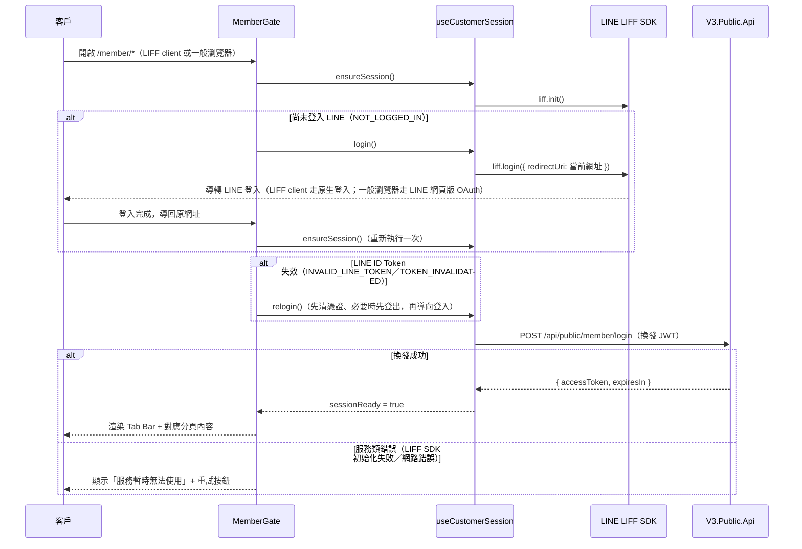

# LIFF 會員中心設計

## 背景

目前 LIFF 相關前端已有兩塊基礎可以直接重用：

- `useCustomerSession.ts`：封裝 LIFF LINE Login、向後端換發客戶授權 JWT（`POST /api/public/member/login`）、`sessionStorage` 儲存與重用、換發失敗分類（身分類 / 服務類）、重新登入流程。已在 `OrderView.vue` 上線驗證過。
- `OrderView.vue`（`/order?t=xxx`）：客戶透過**分享連結 token** 進入的單筆訂單查看與 LINE 綁定頁面。此頁是**被動式**進入（token 驅動、非導覽型）、**lazy 登入**（僅在使用者點擊綁定按鈕時才觸發登入），且刻意做成無 nav/footer 的極簡版面（`meta.minimal`）。

本規格要新增的「會員中心」是一組全新的、**以登入身分為前提的導覽型頁面**，讓已綁定 LINE 的客戶可以自助查詢：

1. 客戶資料（含編輯）
2. 訂單記錄——拆成「服務單」「訂單（銷售訂單）」兩組獨立功能
3. 查詢訂單明細

此頁面群將作為 LIFF App 的**主要 Endpoint**（相對於 `/order` 是分享連結專用的次要入口），與 `/order` 是兩條職責不同、彼此獨立的路徑，不互相依賴。

### 後端 API 現況（`http://localhost:5100/swagger`，2026-08-15 確認）

| 端點 | 說明 |
|---|---|
| `GET /api/public/member/me` | 查詢目前登入會員個人資料（`MemberProfileResponse`：`customerId`、`name`、`phoneNumber`、`email`、`residentialAddress`，皆可為 null） |
| `PATCH /api/public/member/me` | 部分更新會員個人資料，回應直接回傳更新後的完整 `MemberProfileResponse` |
| `GET /api/public/orders?pageNumber&pageSize` | 查詢目前登入會員的服務單＋銷售訂單**混合**清單（分頁，依日期新到舊排序），每筆含 `orderKind: Service\|Sales` |
| `GET /api/public/orders/service/{id}` | 服務單明細（`CustomerServiceOrderDetailResult`：含寄售起訖日、續約選項、品項清單） |
| `GET /api/public/orders/sales/{id}` | 銷售訂單明細（`CustomerSalesOrderDetailResult`：含付款紀錄、收件方式、品項清單） |
| `PATCH /api/public/orders/sales/{id}/delivery` | 修改銷售訂單收件方式（既有 `OrderRecipientSection.vue` 已在用） |

以上端點皆為受保護端點，走既有 `sessionHttp`（自動帶 `Authorization: Bearer`，401 時自動清憑證並廣播 `TOKEN_INVALIDATED`）。

## 相依阻塞／待確認事項

**`GET /api/public/orders` 目前沒有依 `orderKind` 篩選的查詢參數**，只能整批分頁抓「服務單＋訂單」混合清單。本規格的「服務單清單」「訂單清單」兩個獨立分頁，設計上假設後端會新增 `orderKind` 篩選參數（例如 `GET /api/public/orders?orderKind=Service&pageNumber=1&pageSize=20`）。

- **此為明確的後端相依項目，需要在實作前向後端確認是否能新增。**
- **Fallback（若後端無法新增此參數）**：清單元件改為一次抓較大的 `pageSize`（例如 50），前端依 `orderKind` 在記憶體中分組後各自維護「載入更多」的累積清單與是否還有更多資料的判斷。UI 外觀與互動方式不變，只有資料抓取/分頁邏輯需要調整，不影響本規格其他部分的設計。

## 使用者流程



## 架構決策

### 路由與版面

```
/member                          會員中心殼層（MemberGate + 導覽）
  ├─ /member/profile              客戶資料（預設頁）
  ├─ /member/orders/service       服務單清單
  ├─ /member/orders/sales         訂單（銷售訂單）清單
  ├─ /member/orders/service/:id   服務單明細
  └─ /member/orders/sales/:id     訂單明細
```

- 全部標記 `meta: { minimal: true, requiresAuth: true }`：`minimal` 沿用既有慣例（`App.vue` 依此跳過現有 nav bar／footer）；新增的 `requiresAuth` 供 `MemberGate` 判斷是否需要先驗證登入狀態（此路由群全部為 true，但欄位保留給未來若有例外頁面時使用）。
- `router/index.ts` 的 `RouteMeta` 型別新增 `requiresAuth?: boolean`。
- 新增檔案：
  - `src/views/member/MemberLayout.vue`——殼層，內含 `MemberGate` 邏輯 + 響應式導覽 + `<RouterView />`（子路由掛在這個元件底下，用 nested route 實作）
  - `src/components/MemberGate.vue`——授權閘門，`MemberLayout.vue` 內使用
  - `src/components/MemberNav.vue`——響應式導覽（底部 Tab Bar／頂部 Tab 列切換），`MemberLayout.vue` 內使用
  - `src/views/member/ProfileView.vue`
  - `src/views/member/OrderListView.vue`
  - `src/views/member/ServiceOrderDetailView.vue`
  - `src/views/member/SalesOrderDetailView.vue`

### 導覽列（響應式）

- **窄螢幕**（手機、LIFF client 內建瀏覽器）：底部固定 Tab Bar，三顆固定分頁（資料／服務單／訂單），符合行動裝置 App 慣例與單手操作熱區。
- **寬螢幕**（一般桌機瀏覽器，斷點 `≥768px`，對齊 Tailwind `md:`）：改為頂部橫向 Tab 列，位置與既有 `App.vue` nav bar 一致，符合桌機網頁慣例。
- 兩種版面共用同一套路由與狀態，純粹是 CSS 斷點切換顯示位置（`md:` 系列 class 控制），不需要各自維護一份邏輯。
- 明細頁（`/member/orders/service/:id`、`/member/orders/sales/:id`）不屬於任何一個 Tab 分頁、不在 Tab Bar 上高亮任何項目，頁面頂部改顯示「‹ 返回」箭頭連結回對應清單路由。

### `MemberGate` 授權閘門元件

包住整個 `/member` 路由群（放在殼層元件內、`<RouterView>` 外層），只負責「有沒有身分」，不管各分頁各自的資料：

| `exchangeError` 狀態 | 行為 |
|---|---|
| `code === 'NOT_LOGGED_IN'` | 不顯示提示，直接呼叫既有 `login()`（整頁導轉，導回原網址） |
| `code` 為 `INVALID_LINE_TOKEN` 或 `TOKEN_INVALIDATED` | 直接呼叫既有 `relogin()`（先清憑證、必要時先登出，再導向登入） |
| `kind === 'service'`（LIFF SDK 初始化失敗、網路錯誤） | 顯示固定文案「服務暫時無法使用」+ 重試按鈕（呼叫 `ensureSession()`），無法自動導轉解決 |
| 換發成功（`sessionReady === true`） | 渲染 `<RouterView />` + 導覽列 |
| 換發進行中 | 顯示 loading spinner（沿用 `ProductDetailView`／`OrderView` 既有樣式） |

此元件與各分頁元件之間**不重複處理 401**——`sessionHttp` 攔截器已經會在收到 401 時自動清憑證並把 `exchangeError` 設為 `TOKEN_INVALIDATED`，`MemberGate` 監聽同一組共用 `ref`，自動轉為 relogin 流程，各分頁元件只需正常打自己的 API、不用另外 catch 401。

### 頁面元件與資料流

- **`ProfileView.vue`**：`GET /member/me` 唯讀顯示 `name` / `phoneNumber` / `email` / `residentialAddress`（null 顯示「未填寫」）。「編輯」按鈕切換為表單，送出 `PATCH /member/me`（部分更新，未改動欄位維持原值），用回應直接更新畫面狀態，不重新 GET。
- **`OrderListView.vue`**（服務單／訂單兩個路由共用同一元件，用 route meta 或 prop 傳入 `orderKind: 'Service' | 'Sales'` 區分）：`GET /orders?orderKind=...&pageNumber&pageSize`，列表每列顯示 `orderNumber`／`orderKindDisplay`／`orderDate`／`totalAmount`（複用 `OrderView.vue` 既有的貨幣格式化邏輯）／狀態（複用既有 `OrderStatusBadge.vue`）。分頁用「載入更多」按鈕累加清單（比 infinite scroll 實作簡單，符合手機瀏覽習慣），累積數量達 `totalCount` 後隱藏按鈕。空清單顯示對應的「目前沒有服務單／訂單」文案。整列可點擊（比照 `OrderView.vue` 品項列的可點擊列 + chevron 圖示慣例），導向對應明細路由。
- **`ServiceOrderDetailView.vue`**：`GET /orders/service/{id}`，畫面結構比照 `OrderView.vue` 既有摘要卡片＋品項清單樣式，額外顯示 `consignmentStartDate`／`consignmentEndDate`／`renewalOption`。純唯讀（後端目前未提供服務單的客戶端編輯端點）。
- **`SalesOrderDetailView.vue`**：`GET /orders/sales/{id}`，同樣的摘要卡片＋品項清單樣式，額外顯示付款紀錄（`paymentRecords[]`）與貨運資訊；複用既有 `OrderRecipientSection.vue`（`:detail` / `:order-id` / `@updated`，元件已通用，不需修改）處理收件資訊的顯示與編輯。
- **403／404 統一處理**：明細頁若收到 403（訂單存在但不屬於此會員）或 404（不存在），一律顯示同一種固定文案「找不到此筆紀錄」，不區分原因、不透傳後端訊息——避免讓使用者能透過網址列猜測 id 判斷「這筆訂單存在但不是我的」，比照現有 `order.errorInvalidLink` 不區分失效原因的設計慣例。

### 視覺風格

`/member` 系列沿用 `OrderView.vue` 已建立的 LIFF 頁面視覺語言（而非 `HomeView.vue` 的行銷首頁風格——兩者調性不同：後者是大標題＋hero 光暈的公開行銷頁，前者才是資訊密集、功能性的已登入頁面），不新發明一套樣式：

- **卡片**：`bg-white border border-outline-variant/30 shadow-sm p-6`（`ProfileView`／清單列／明細摘要卡一律套用）。
- **欄位 label**：`font-label-caps text-xs text-secondary uppercase tracking-wider`；**數值**：`font-data-mono text-sm text-on-surface`（金額／編號等）或 `font-title-lg text-sm text-on-surface`（人名等一般文字）。
- **主要按鈕**：`bg-primary text-white ... hover:bg-primary-container transition-colors duration-300 tracking-widest`；`disabled:opacity-50 disabled:cursor-not-allowed` 處理 loading/disabled 狀態。
- **圖示**：`material-symbols-outlined`（既有頁面全部使用這套，不引入其他 icon 集）。
- **品牌標記／語言切換**：`MemberLayout.vue` 頂部沿用 `OrderView.vue` 既有的小 favicon 圖示（`w-10 h-10 rounded-xl`）＋右上角 `toggleLocale` 按鈕樣式，不用完整 nav bar。
- **Loading／狀態圖示**：沿用既有 spinner（`border-2 border-primary-container border-t-primary rounded-full animate-spin`）與錯誤圖示（`material-symbols-outlined` + `gpp_maybe` 或語意相近圖示）慣例。
- **`MemberNav.vue`（Tab Bar／Tab 列，本次新設計、無既有先例可抄）**：
  - 選中狀態用 `text-primary`，未選中用 `text-secondary`，符合既有「primary 代表可互動／目前焦點」的用色慣例。
  - 分隔線／外框用 `border-outline-variant/30`（與卡片邊框同一色階，維持一致）。
  - 底部 Tab Bar 背景 `bg-surface`（比照 `App.vue` nav bar 的 `bg-surface/80 backdrop-blur-md`），固定於視窗底部，`z-50` 避免被內容蓋住；頂部 Tab 列（`md:` 以上）比照 `App.vue` nav bar 的高度與 `max-w-container-max mx-auto px-margin-mobile` 版心設定。
  - 每個 Tab 項目文字用 `font-label-caps text-xs tracking-wider`，與既有導覽/按鈕文字字級一致。

### API 呼叫慣例

沿用專案既有風格：元件內直接用 `sessionHttp`（或原生 `axios`，視是否需要授權而定）呼叫，不另外抽 service 層。成功時取 `response.data.data`，錯誤處理走固定 i18n 文案，不透傳後端 `message` 原文。

### i18n

新增 `member` namespace（`en` + `zh-TW` 都要補齊），沿用現有 `order.*` 命名風格：

- `member.gate.loading` / `member.gate.serviceUnavailable` / `member.gate.retry`
- `member.nav.profile` / `member.nav.serviceOrders` / `member.nav.salesOrders`
- `member.profile.*`（各欄位 label、`notProvided`、`editButton`、`saveButton`、`cancelButton`、`saveSuccess`、`saveError`）
- `member.orders.service.*` / `member.orders.sales.*`（各自的 `title`、`empty`、`loadMore`）——與清單/明細共用的欄位 label（`orderNumber`、`orderDate`、`totalAmount` 等）沿用既有 `order.summary.*` key，不重複定義
- `member.orders.errorNotFound`（403／404 共用）
- `member.orders.service.consignmentStartDate` / `consignmentEndDate` / `renewalOption`
- `member.orders.sales.paymentRecords.*`

## 不在此規格範圍

- 後端新增 `orderKind` 篩選參數本身（不同 repo，屬於前述「相依阻塞」項目）。
- LINE 官方帳號 LIFF App 後台設定（新增/調整 Endpoint URL 指向 `/member`、Channel 設定等）——這是 LINE 官方帳號負責人／後端的職責，不屬於本前端 repo。
- 服務單／訂單清單的搜尋、篩選（除 `orderKind` 外）、排序功能——僅依後端既有「日期新到舊」排序。
- 服務單明細的編輯功能——後端目前未提供對應的客戶端 PATCH 端點。
- 會員點數／會員等級／推播通知偏好設定等其他常見會員中心功能——不在本次「客戶資料／服務單／訂單／訂單明細」四項範圍內，若未來需要屬於獨立規格。
- Mock 資料層——`GET /member/me`、`GET /orders`、`GET /orders/service/{id}`、`GET /orders/sales/{id}` 皆已上線可用（不同於 `2026-07-23-liff-order-view-design.md` 當時 `orders/view`／`orders/bind` 尚未上線的情況），可直接對接真實端點開發。

## 實作注意事項

1. `orderKind` 篩選參數需先向後端確認；若實作當下仍未提供，先照「相依阻塞」章節的 fallback 方案實作，待後端補上後再切換回篩選參數版本。
2. `MemberGate` 的自動導轉登入（`NOT_LOGGED_IN` 時不經使用者點擊直接 `login()`）與 `OrderView.vue` 現有的「顯示提示、等使用者點擊」模式不同，是本次刻意的行為差異——因為會員中心整體都需要身分才有意義，不像 `OrderView` 未綁定訂單仍可先看到摘要。
3. 響應式導覽的斷點（`md:` / `768px`）沿用 Tailwind 預設中斷點，不另外自訂。
